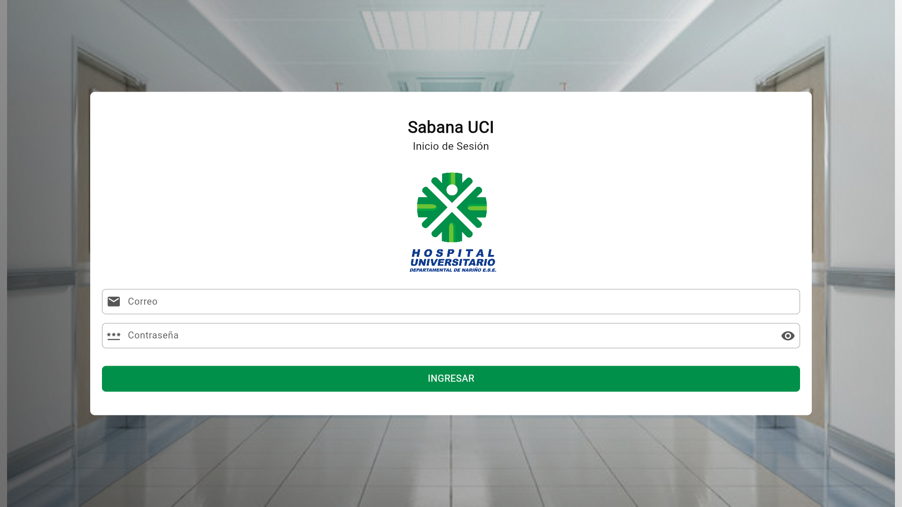
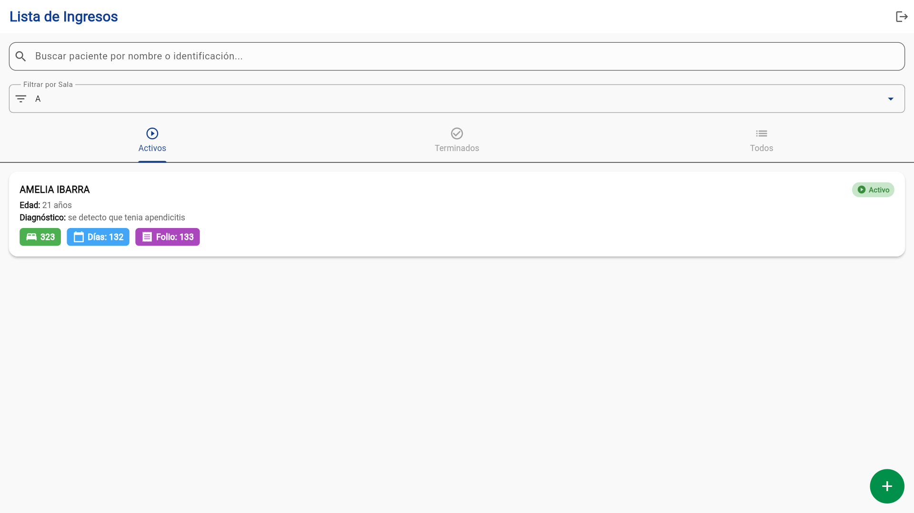
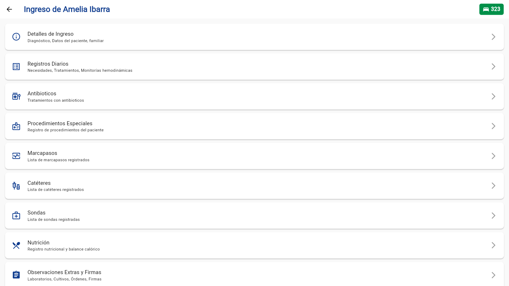
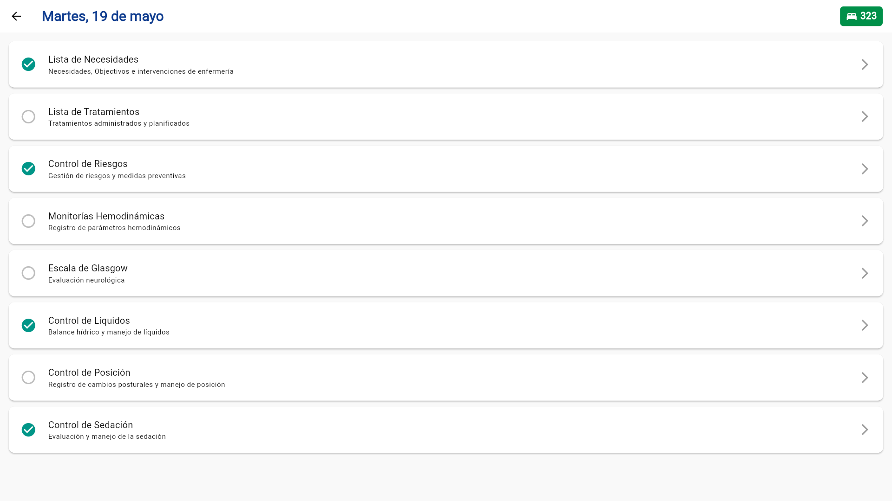
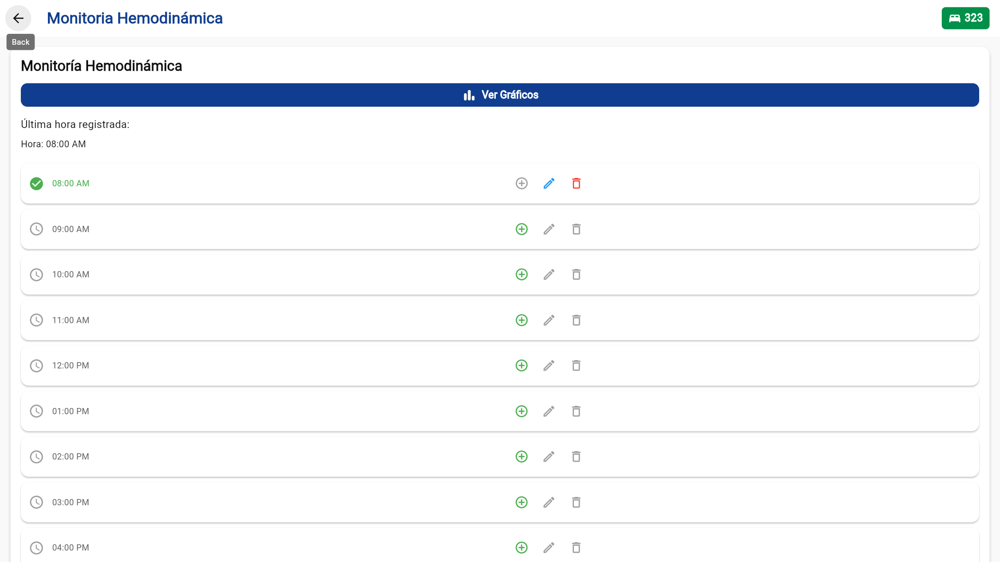
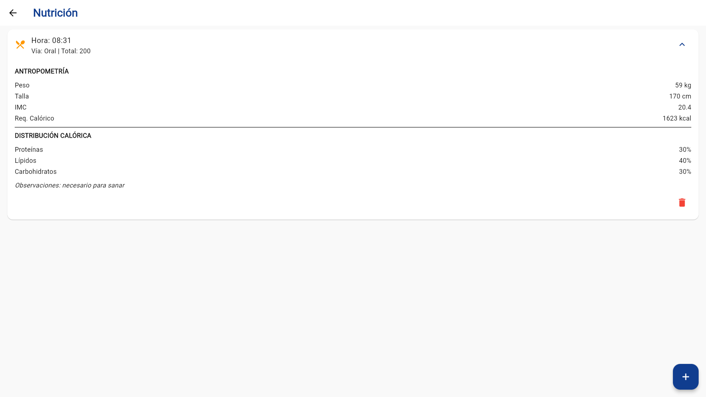
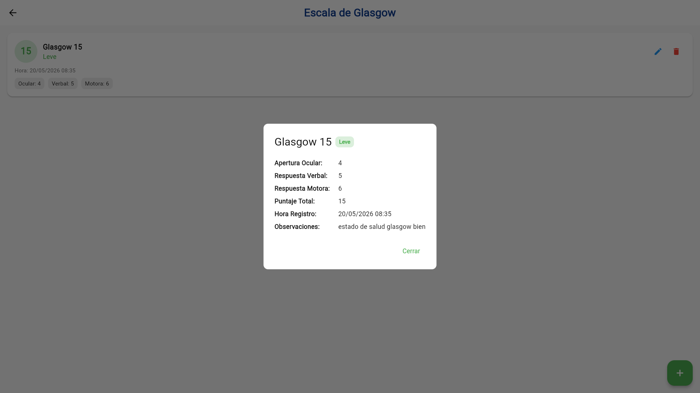
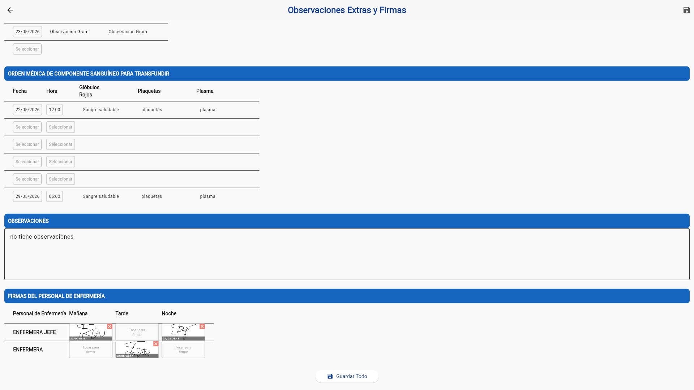
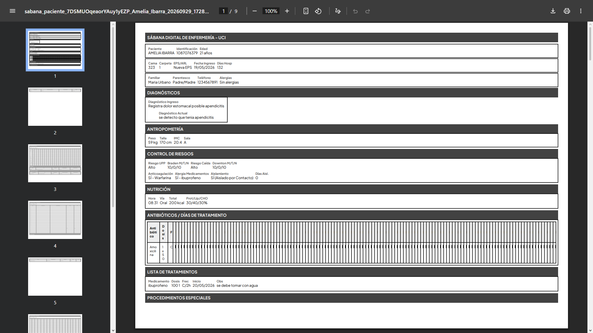
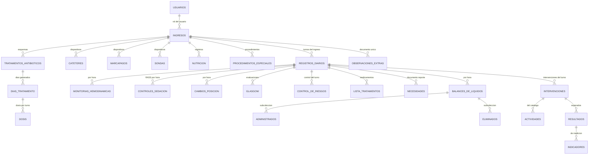

# Sábana Digital de Enfermería


<p align="center">
  
</p>

## Descripción

**Sábana Digital de Enfermería** es una aplicación multiplataforma desarrollada en Flutter para la **Unidad de Cuidados Intensivos (UCI)** del **Hospital Universitario Departamental de Nariño (HUDN)**, en Pasto (Colombia).

Su propósito es reemplazar la sábana clínica de papel que usa el personal de enfermería para el registro diario de pacientes críticos. La aplicación permite **registrar, consultar, firmar y exportar** los datos clínicos en tiempo real, elimina los errores de transcripción de las hojas manuales y reproduce el flujo de trabajo real de los turnos de **mañana, tarde y noche**.

Fue validada directamente con el personal de enfermería de la UCI y cubre los 23 módulos del registro clínico: monitoría hemodinámica, balance de líquidos, nutrición, evaluación neurológica, control de sedación, dispositivos médicos, antibióticos, control de riesgos, el proceso de enfermería **NIC/NOC** y la generación del reporte PDF de la sábana.

> **Alcance:** el repositorio contiene el código de la aplicación. No incluye información clínica de pacientes, bases de datos reales ni credenciales de producción.

## Demo en vivo

| Recurso | Enlace |
|---------|--------|
| Aplicación web | [](https://sabana-digital-prueba.web.app) |
| Video del proyecto | [](https://drive.google.com/file/d/1h4RWSBFs4COVogQA5zYAYrFqs7AyZJgZ/view?usp=sharing) |
| Manual de usuario | [](Manual%20de%20Usuario%20-%20S%C3%A1bana%20Digital%20de%20Enfermer%C3%ADa.docx.pdf) |

> **Nota:** la demo requiere iniciar sesión con una cuenta de la base de datos de prueba. Los datos precargados son ficticios.

## Documentación incluida

| Documento | Contenido |
|-----------|-----------|
| [`Manual de Usuario`](Manual%20de%20Usuario%20-%20S%C3%A1bana%20Digital%20de%20Enfermer%C3%ADa.docx.pdf) | Guía paso a paso de cada módulo, pensada para el personal de enfermería |
| [`Guía Técnica`](Gu%C3%ADa%20T%C3%A9cnica%20-%20S%C3%A1bana%20Digital%20de%20Enfermer%C3%ADa.docx.pdf) | Documento técnico del proyecto para la institución |
| [`Guía de migración a Firebase`](README%20-%20Migraci%C3%B3n%20Firebase.md) | Cómo crear el proyecto, configurar Firestore, crear usuarios con rol y desplegar |
| [`HU Sabana Digital Registro UCI.xlsx`](HU%20Sabana%20Digital%20Registro%20UCI.xlsx) | Plantilla en Excel de la sábana física que la app reemplaza |
| [`Link Video SABANA DIGITAL REGISTRO UCI.md`](Link%20Video%20SABANA%20DIGITAL%20REGISTRO%20UCI.md) | Enlace al video de demostración |

## Funcionalidades principales

| Módulo | Descripción |
|--------|-------------|
|  | Registro de pacientes con diagnósticos, cama, sala y contacto familiar |
|  | Signos vitales y parámetros hemodinámicos registrados hora a hora, con gráficos |
|  | Líquidos administrados y eliminados por hora, con balance calculado automáticamente |
|  | Escala de Glasgow con puntaje total y clasificación automáticos |
|  | Escala RASS de −5 a +4 por hora para el control de la sedación |
|  | Úlceras por presión, riesgo de caídas, anticoagulación, aislamientos y alergias |
|  | Catéteres, marcapasos, sondas y drenajes con fechas de inserción y retiro |
|  | Esquemas antibióticos con generación automática de días y dosis por turno |
|  | Proceso de enfermería: necesidades, intervenciones, resultados e indicadores |
|  | Seis paneles de firma digital por turno, almacenadas en Firestore |
|  | Sábana clínica en PDF de seis páginas, lista para compartir o imprimir |

## Capturas de pantalla

Las capturas se guardan en `assets/screenshots/`, en la raíz del repositorio, por lo que **no se empaquetan en los builds** de ninguna plataforma.

GitHub no permite superponer texto sobre una imagen en el README, así que cada nombre se ubica en una celda encima de su captura. La guía para tomarlas está en [`assets/screenshots/README.md`](assets/screenshots/README.md).

### Acceso y gestión de pacientes

<table>
  <tr>
    <td align="center" width="360"><strong>Inicio de sesión</strong><br>Acceso con correo y contraseña</td>
    <td align="center" width="360"><strong>Lista de ingresos</strong><br>Buscador y filtro por sala</td>
    <td align="center" width="360"><strong>Detalle del ingreso</strong><br>Datos del paciente y diagnóstico</td>
  </tr>
  <tr>
    <td align="center"></td>
    <td align="center"></td>
    <td align="center"></td>
  </tr>
</table>

### Registro clínico diario

<table>
  <tr>
    <td align="center" width="360"><strong>Registro diario</strong><br>Las ocho secciones del turno</td>
    <td align="center" width="360"><strong>Monitoría hemodinámica</strong><br>Parámetros hora a hora</td>
    <td align="center" width="360"><strong>Gráficos</strong><br>Curvas de presión arterial</td>
  </tr>
  <tr>
    <td align="center"></td>
    <td align="center"></td>
    <td align="center"></td>
  </tr>
</table>

### Balance, nutrición y evaluación

<table>
  <tr>
    <td align="center" width="360"><strong>Balance de líquidos</strong><br>Administrados y eliminados</td>
    <td align="center" width="360"><strong>Nutrición</strong><br>IMC y requerimiento calórico</td>
    <td align="center" width="360"><strong>Escala de Glasgow</strong><br>Puntaje y clasificación</td>
  </tr>
  <tr>
    <td align="center"></td>
    <td align="center"></td>
    <td align="center"></td>
  </tr>
  <tr>
    <td align="center" width="360"><strong>Control de sedación</strong><br>Escala RASS por hora</td>
    <td align="center" width="360"><strong>Catéteres</strong><br>Tipos, vías y fechas</td>
    <td align="center" width="360"><strong>Antibióticos</strong><br>Días y dosis por turno</td>
  </tr>
  <tr>
    <td align="center"></td>
    <td align="center"></td>
    <td align="center"></td>
  </tr>
</table>

### Proceso de enfermería y cierre de turno

<table>
  <tr>
    <td align="center" width="360"><strong>Lista de necesidades</strong><br>Valoración de enfermería (NIC)</td>
    <td align="center" width="360"><strong>Observaciones y firmas</strong><br>Laboratorios, transfusiones y firmas</td>
    <td align="center" width="360"><strong>Reporte PDF</strong><br>Sábana clínica de seis páginas</td>
  </tr>
  <tr>
    <td align="center"></td>
    <td align="center"></td>
    <td align="center"></td>
  </tr>
</table>

## Funcionalidades

### Acceso y sesión
- Inicio de sesión con correo y contraseña mediante Firebase Authentication.
- Restauración automática de la sesión al abrir la aplicación.
- Carga del rol del usuario desde Firestore y control de las acciones disponibles.
- Pantalla de bienvenida con la identidad institucional.

### Ingresos de pacientes
- Alta de ingresos con datos de identificación, EPS o ARL, carpeta, diagnósticos de ingreso y actual, peso, talla, cama, alergias, sala (A–D) y datos del familiar.
- Búsqueda por nombre o número de identificación, y filtro por sala.
- Separación en pestañas de **activos**, **terminados** y **todos** según la fecha de egreso.
- Edición de los datos del ingreso.

### Registros diarios
- Un registro por turno, con las ocho secciones clínicas del paciente.
- Acceso directo a cada sección desde la página del registro.

### Monitoría hemodinámica
- Registro horario de presión arterial (sistólica, diastólica y media), frecuencia cardíaca, frecuencia respiratoria, temperatura, presión venosa central, gasto cardíaco, índice cardíaco, resistencias vasculares, saturación, FiO2, presión intraabdominal, presión pulmonar, glucemia, insulina y más.
- El horario cubre las 24 horas, desde las 8 a. m. de un día hasta las 7 a. m. del siguiente.
- Gráficos de la evolución de la presión arterial con `fl_chart`.

### Balance de líquidos
- Registro horario de líquidos administrados y eliminados.
- Dieciséis vías de eliminación: diuresis, pérdidas insensibles, sonda gástrica, residuo gástrico, tubos de tórax, drenaje mediastinal, drenaje abdominal, ileostomía, fístula enterocutánea, deposición, diálisis, ventriculostomía externa y dos campos libres.
- Tarjeta de resumen con el balance acumulado del registro diario.

### Nutrición
- Registro antropométrico con cálculo automático del **IMC** y del **requerimiento calórico**, con clasificación del estado nutricional.
- Nutrición administrada por hora con distribución de proteínas, lípidos y carbohidratos.

### Evaluación neurológica y sedación
- **Escala de Glasgow:** apertura ocular, respuesta verbal y respuesta motora, con puntaje total y clasificación en leve, moderado o grave.
- **Escala RASS:** nivel de sedación de −5 a +4 registrado por hora, con observación libre.
- **Cambio de posición:** registro horario de la posición del paciente para la prevención de úlceras por presión.

### Dispositivos médicos
- **Catéteres:** venoso central, venoso periférico y arterial, con catorce vías anatómicas, fecha de inserción, fecha de retiro, fecha de curación o cambio y características del sitio.
- **Marcapasos:** modos VVI, AAI, DDD, VOO, AOO y DOO, con frecuencia, sensibilidad y salida.
- **Sondas y drenajes:** 70 dispositivos organizados en siete regiones anatómicas, con fecha de colocación y retiro.

### Tratamientos
- **Antibióticos:** al crear un tratamiento se generan automáticamente los días hasta la fecha actual y las dosis de cada turno según la frecuencia en 24 horas, con opción de finalizarlo.
- **Procedimientos especiales:** seguimiento por estados (por realizar, realizado, reportado) con datos de infusión.

### Control de riesgos
- Úlceras por presión con catálogo de sitios anatómicos, reporte de eventos y días con úlcera.
- Riesgo de caídas, uso de anticoagulantes y reacciones adversas asociadas.
- Aislamiento con tipo, agente, fechas de inicio y fin, y días de aislamiento.
- Alergia a medicamentos.
- Controles de úlceras y caídas por turno: mañana, tarde y noche.

### Proceso de enfermería (NIC / NOC)
- **Lista de necesidades:** valoración de las necesidades detectadas, objetivos de enfermería, intervenciones realizadas y revista médica.
- **Intervenciones:** catálogo de intervenciones con sus actividades, con la opción de importar las de otro registro.
- **Resultados e indicadores:** resultados esperados e indicadores de cada intervención.
- **Firma:** al firmar las necesidades o las intervenciones, la sección queda en solo lectura y ya no puede modificarse.

### Observaciones extras y firmas
- Solicitudes de laboratorio y radiología, cultivos, órdenes de transfusión (glóbulos rojos, plaquetas y plasma) y observaciones libres.
- Seis paneles de firma digital — enfermería jefe y enfermera, una por turno — almacenadas en Firestore.

### Reporte PDF
- Generación de la sábana clínica completa en un PDF de **seis páginas A4 horizontales**:
  1. Datos generales, diagnósticos, riesgos, nutrición, antibióticos y tratamientos.
  2. Monitoría hemodinámica, marcapasos y catéteres.
  3. Líquidos administrados y sondas.
  4. Líquidos eliminados y resumen del balance.
  5. Glasgow, RASS y cambios de posición.
  6. Laboratorios, cultivos, transfusiones, necesidades, observaciones y firmas.
- El documento incluye las tipografías de la aplicación y se puede guardar, imprimir o compartir desde el dispositivo.
- La recolección de datos reintenta automáticamente ante fallos de conexión, algo habitual en la red del hospital.

## Roles de usuario

El rol se define en el campo `rol` del documento del usuario, dentro de la colección `usuarios` de Firestore. La aplicación reconoce seis valores:

| Valor en Firestore | Rol | Permisos en la interfaz |
|--------------------|-----|--------------------------|
| `ADMIN` | Administrador | Acceso completo: puede crear, editar, eliminar y firmar |
| `ENFERMERO_JEFE` | Enfermero jefe | Registro y consulta de datos clínicos |
| `AUXILIAR_ENFERMERIA` | Auxiliar de enfermería | Registro y consulta de datos clínicos |
| `NUTRICIONISTA` | Nutricionista | Registro y consulta de datos clínicos |
| `MEDICO` | Médico | Registro y consulta de datos clínicos |
| `INVITADO` | Invitado | Acceso de solo lectura |

> **Nota sobre el estado actual:** la interfaz solo distingue el rol `ADMIN`, que es el único que ve los botones de edición, eliminación y firma. Los demás roles se comportan igual entre sí y su differentiation depende de las reglas de seguridad de Firestore. Si necesitas permisos distintos por rol, hay que extender los puntos de control de la interfaz y endurecer las reglas. Consulta la sección [Seguridad](#seguridad).

## Arquitectura

El código sigue **Clean Architecture**. Cada módulo funcional tiene su propia carpeta en `lib/features/` con las capas separadas:

```
lib/
├── main.dart              → inicialización de Firebase, tema, sesión y rutas
├── common/                → componentes, temas, extensiones, validadores y utilidades
│   ├── components/        → botones, campos de formulario, tarjetas y tablas
│   ├── constants/         → nombres de colecciones de Firestore
│   ├── errors/            → widgets de error y sesión expirada
│   ├── extensions/        → capitalize, intToDayString, stringToDate, stringToTime
│   ├── providers/         → providers compartidos
│   ├── themes/            → tema Material 3 y paleta institucional
│   ├── utils/             → selectores de fecha y hora
│   └── validators/        → validación de formularios
├── constants/
│   └── intervenciones.dart → catálogo estático de intervenciones, resultados e indicadores
├── features/              → 23 módulos, cada uno con data / domain / presentation
│   └── <módulo>/
│       ├── data/          → repositorios, DTOs y providers
│       ├── domain/        → modelos Freezed y enums
│       └── presentation/  → controladores, widgets y pantallas
└── pages/                 → 56 pantallas organizadas por módulo
```

| Capa | Responsabilidad |
|------|-----------------|
| `domain` | Modelos de datos generados con Freezed e inmutables |
| `data` | Repositorios de Firestore y transformación de DTOs |
| `presentation` | Pantallas, formularios y controladores de estado |
| `application` | Servicios de aplicación, como el generador de reportes PDF |

**Gestión de estado:** Riverpod (`hooks_riverpod`) con `Provider`, `FutureProvider`, `AsyncNotifierProvider` y `Provider.family`.
**Navegación:** `Navigator` con paso de identificadores por constructor.
**Generación de código:** Freezed y `json_serializable` mediante `build_runner`.

## Modelo de datos

Cloud Firestore con dos colecciones raíz: `usuarios` y `ingresos`. Cada ingreso tiene sus propias subcolecciones, y cada registro diario anida las secciones clínicas del turno.



| Colección | Contenido |
|-----------|-----------|
| `usuarios` | Nombre, correo y rol (`ADMIN`, `ENFERMERO_JEFE`, `AUXILIAR_ENFERMERIA`, `NUTRICIONISTA`, `MEDICO`, `INVITADO`) |
| `ingresos` | Datos del paciente, diagnósticos, peso, talla, cama, sala, alergias, fecha de ingreso y de egreso |
| `registrosDiarios` | Un documento por turno, con la fecha del registro y las firmas de necesidades e intervenciones |
| `monitoriasHemodinamicas` | Signos vitales y parámetros hemodinámicos por hora |
| `balancesDeLiquidos` | Balance horario, con las subcolecciones `administrados` y `eliminados` |
| `glasgow` | Puntos de la escala, total y clasificación |
| `controlesSedacion` | Nivel RASS y observación por hora |
| `cambiosPosicion` | Posición del paciente por hora |
| `controlDeRiesgos` | Úlceras, caídas, anticoagulación, aislamientos, alergias y controles por turno |
| `listaTratamientos` | Medicamentos administrados con cantidades y fechas |
| `necesidades` | Necesidades detectadas, objetivos, intervenciones y revista médica |
| `intervenciones` | Referencias a las intervenciones aplicadas en el registro |
| `cateteres` / `marcapasos` / `sondas` | Dispositivos con vía, fechas y características |
| `tratamientosAntibioticos` | Antibiótico, dosis, frecuencia, con subcolecciones `diasTratamiento` y `dosis` |
| `nutricion` | Peso, talla, IMC, requerimiento calórico y nutrientes administrados |
| `procedimientosEspeciales` | Procedimiento, estado y datos de infusión |
| `observaciones_extras` | Solicitudes, cultivos, transfusiones, observaciones y firmas |

## Tecnologías utilizadas

| Capa | Tecnología |
|------|------------|
| Aplicación | Flutter / Dart, con soporte para Android, iOS, Web, Windows, macOS y Linux |
| Estado | Riverpod (`hooks_riverpod`) |
| Autenticación | Firebase Authentication, correo y contraseña |
| Base de datos | Cloud Firestore, con consultas en tiempo real |
| Modelos | Freezed y `json_serializable` |
| Reportes | `pdf` y `printing` para generar y compartir la sábana en PDF |
| Firmas | `signature` para los paneles de firma digital |
| Gráficos | `fl_chart` para las curvas de monitoría hemodinámica |
| Tipografía | Plus Jakarta Sans, más Sacramento para las firmas |
| Internacionalización | `intl` con locale `es_ES` |
| Identidad visual | Material 3, azul institucional `#103D8F`, verde `#009049` y verde lima `#69C335` |

## Requisitos previos

- **Flutter 3.x** con Dart 3.4 o superior.
- **Una cuenta de Firebase** con Authentication, Cloud Firestore y, opcionalmente, Hosting.
- **Firebase CLI** (`npm install -g firebase-tools`) y **FlutterFire CLI** (`dart pub global activate flutterfire_cli`).
- **Node.js y npm** para la CLI de Firebase.

## Instalación y ejecución

### 1. Clonar el repositorio

```bash
git clone https://github.com/printEsneyder/sabana-digital-enfermeria-uci.git
cd sabana-digital-enfermeria-uci
```

### 2. Instalar las dependencias

```bash
flutter pub get
```

### 3. Generar el código de los modelos

Los modelos con Freezed y `json_serializable` ya están versionados, pero si los modificas necesitas regenerarlos:

```bash
dart run build_runner build --delete-conflicting-outputs
```

### 4. Conectar con tu proyecto de Firebase

**Este paso es obligatorio:** `lib/firebase_options.dart` está en `.gitignore` y no se publica en el repositorio. Sin ese archivo la aplicación no puede inicializar Firebase.

```bash
firebase login
flutterfire configure --project=<ID_DEL_PROYECTO>
```

Para construir la base de datos desde cero —colecciones, usuarios con rol y reglas— sigue la [`Guía de migración a Firebase`](README%20-%20Migraci%C3%B3n%20Firebase.md).

### 5. Ejecutar la aplicación

```bash
flutter run                  # dispositivo o emulador conectado
flutter run -d chrome        # versión web
```

## Compilación y publicación

```bash
# APK para Android
flutter build apk --release

# Aplicación web
flutter build web --release
firebase deploy --only hosting
```

El `applicationId` de Android es `co.edu.umariana.registro_uci` y el nombre visible en las tres plataformas es **Sábana UCI**.

## Pruebas

El repositorio incluye pruebas de las extensiones puras de Dart, que no requieren conexión con Firebase:

```bash
flutter test
```

`test/widget_test.dart` cubre las conversiones de texto a fecha, hora y día de la semana que usa toda la aplicación. La cobertura de los controladores, repositorios y del generador de PDF está pendiente.

## Estado del proyecto

| Aspecto | Estado |
|---------|--------|
| Módulos funcionales | 23 módulos implementados |
| Pantallas | 56 archivos de pantalla en `lib/pages/` |
| Código | 450 archivos Dart, unas 39 600 líneas escritas a mano |
| Validación | Probado con el personal de enfermería de la UCI |
| Compilación | Android, iOS, Web, Windows, macOS y Linux |
| Reporte PDF | Seis páginas A4 horizontales |
| Pruebas automatizadas | Un archivo que cubre las extensiones de Dart |
| Reglas de seguridad | Deben ajustarse por rol antes de operar con datos reales |

## Seguridad

Este repositorio es público y la aplicación maneja **datos clínicos de pacientes**. Ten en cuenta lo siguiente antes de operar el proyecto:

- **La configuración de Firebase no se publica.** `lib/firebase_options.dart`, `android/app/google-services.json` e `ios/Runner/GoogleService-Info.plist` están en `.gitignore`. Cada quien genera la suya con `flutterfire configure`.
- **Usa una base de datos de prueba.** No cargues pacientes reales en un proyecto de Firebase abierto o en el plan gratuito, y no adjuntes capturas con datos clínicos a ninguna issue.
- **Las reglas de Firestore deben estar publicadas y ajustadas por rol.** La guía de migración incluye un ejemplo de reglas abiertas que solo comprueba que exista sesión. Eso permite que cualquier cuenta autenticada lea y escriba todos los registros clínicos. Deben restringirse por rol y por documento antes de usar la aplicación con datos reales.
- **La interfaz no es una frontera de seguridad.** Flutter es una aplicación cliente: cualquier persona puede llamar a Firestore directamente si las reglas no lo impiden. Por eso el control de acceso debe vivir en las reglas.
- **Firmas digitales.** Las firmas se guardan como imágenes base64 dentro de los documentos de Firestore. Confirma que la política de la institución permite almacenarlas así antes de operar.

## Preguntas frecuentes

**¿Por qué no se ven las imágenes del README?**
Las capturas todavía no están en el repositorio. La guía de captura, con la lista exacta de archivos y los datos que debes evitar, está en [`assets/screenshots/README.md`](assets/screenshots/README.md).

**¿La aplicación corre en el navegador?**
Sí. No depende de plugins nativos, así que funciona en web, escritorio y móvil con el mismo código.

**¿Por qué no compila después de clonar?**
Falta generar `lib/firebase_options.dart` con `flutterfire configure`. Está excluido del repositorio a propósito.

**¿Dónde se configura el rol de un usuario?**
En el campo `rol` de su documento dentro de la colección `usuarios` de Firestore. El valor debe ser uno de: `ADMIN`, `ENFERMERO_JEFE`, `AUXILIAR_ENFERMERIA`, `NUTRICIONISTA`, `MEDICO` o `INVITADO`.

**¿Cómo cambio de proyecto de Firebase?**
Consulta la [`Guía de migración a Firebase`](README%20-%20Migraci%C3%B3n%20Firebase.md), que explica el proceso completo paso a paso.

**¿Qué pasa si un firmado intenta modificar una sección?**
Las secciones de necesidades e intervenciones quedan en solo lectura en cuanto se firma. No se pueden deshacer las firmas desde la interfaz.

**¿Dónde queda guardado el reporte PDF?**
Se genera en memoria y se abre con el visor del sistema, desde donde puedes guardarlo, imprimirlo o compartirlo.

**¿Puedo usarlo con otro hospital?**
Sí, con dos cambios: el catálogo de intervenciones NIC/NOC de `lib/constants/intervenciones.dart` es el de la institución y debe ajustarse, y hay que revisar los nombres de las colecciones en los repositorios.

## Autor

**Esneyder Jesús Ibarra Rosero** — Ingeniero de Sistemas

Desarrollo, integración con Firebase, generación de reportes PDF y validación con el personal de enfermería.

- **Correo:** [esneydribarra1970@gmail.com](mailto:esneydribarra1970@gmail.com)
- **LinkedIn:** [esneyder-ibarra-rosero](https://www.linkedin.com/in/esneyder-ibarra-rosero)
- **GitHub:** [printEsneyder](https://github.com/printEsneyder)

### Agradecimientos

- **Hospital Universitario Departamental de Nariño** — por el acceso a la UCI y la validación del flujo de trabajo.
- **Universidad Mariana**, Facultad de Ingeniería, Programa de Ingeniería de Sistemas — por el acompañamiento de la práctica profesional.
- Al personal de enfermería de la UCI del HUDN, que probó la aplicación durante su jornada de trabajo.

---

<p align="center">
  Sábana Digital de Enfermería · UCI · Hospital Universitario Departamental de Nariño
</p>

<p align="center">
  <a href="https://sabana-digital-prueba.web.app">
    
  </a>
  <a href="https://www.linkedin.com/in/esneyder-ibarra-rosero">
    
  </a>
  <a href="mailto:esneydribarra1970@gmail.com">
    
  </a>
</p>
